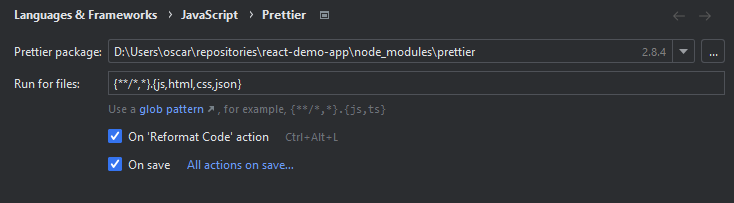
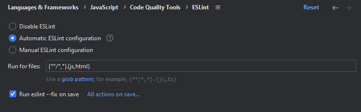

# react-demo-app

This project was bootstrapped with [Create React App](https://github.com/facebook/create-react-app). It makes use of the
`react-router` to handle routing like a SPA, `redux` for global state management, and `bootstrap` and `fontawesome` for
styling and some icons.

Although a testing suit is included, the tests have not yet been updated and running the tests will result in errors atm.

You can check the application out on a live GitHub Pages at: https://NoNamer777.github.io/react-demo-app/  
Alternatively, you can follow the instructions below to build and run the application yourself locally.

## How the routing, store and components work together

How I implemented routing and updating the state is as follows:

The `FilteringSortingPanelComponent` is responsible for managing the state and query params for sorting and filtering.
When selecting a filter or set the sorting will not immediately change the params, pressing the apply button will make
the changes that effect.

When pressing apply, The query params will be updated. Another listener will respond to the changes to the query params
and propagate the changes from the query params to the store and back into the input controls of the
`FilteringSortingPanelComponent` (The input controls won't noticeably change at that point, because they were already
changed by the User). 

On page load, or refreshing the page the query params will be read and the input controls and store initial values will
be updated based on those values.

Whenever the `Reset` button is pressed, the query params, store AND input controls will be reset back to the default
values.

The `PaginationComponent` is responsible for managing the slice of data that is shown in the `OverviewPage`.

On page load, or refreshing of the page, the only task of the `PaginationComponent` is to read the query params, get the
current page that the `OverviewPage` should be showing, store that information in the global state store and recalculate
the total number of pages whenever that data is filtered.

The `OverviewPage` will use the global state store to get the correct slice of data, based on the current page in the store
and change the shown data whenever the current page is changed in the store, or whenever sorting or filtering is applied.

## Setup

Before you're able to work in this project, please make sure that you've at least installed node v16 and npm v8.
After that you can install the dependencies for this project by running the following command in the root of this project:

```shell
npm install
```

### ESLint and Prettier

This project is working with [ESLint](https://eslint.org/) and [Prettier](https://prettier.io/).
To make your editor work with these tools, please check [here](https://prettier.io/docs/en/editors.html) to make sure
Prettier formats your files after every save. For ESLint, check
[here](https://eslint.org/docs/latest/use/integrations#editors) for more info about configuring your editor

#### Webstorm

For Webstorm, the Prettier configuration should look like the following:



And the ESLint configuration should like the following:



#### Visual Studio Code

For VSC a list with recommended extensions is provided with this project, so please make sure to install those.
The project also contains workspace settings so that those extensions will run on every save to fix formatting and linting
errors, should the pop-up.

### Environment variables

A couple of environment variables need to be set before you are able to run the application. These need to be set in a
`.env.local` file in the root of the project. Please, create this file and add the following contents:

```
# This makes sure that upon running the `start` script, your browser won't open automatically
BROWSER=none

# This will make sure the development application will run on port 4200
PORT=4200

# Forces the build to target resources at the root of the application, for GitHub Pages this could be changed to a different
# value to make sure your application can find its resources
PUBLIC_URL=/

# Outputs the result of the `build` script to the target folder determined below
BUILD_PATH=dist/react-demo-app
```

For more information about these environment variables, please refer to the
[advanced configuration](https://create-react-app.dev/docs/advanced-configuration/) section.

## Available Scripts

In the project directory, you can run the following scripts:

| Script                 | Description                                                                                                                                                                                                                                                                                                                                               |
|------------------------|-----------------------------------------------------------------------------------------------------------------------------------------------------------------------------------------------------------------------------------------------------------------------------------------------------------------------------------------------------------|
| `npm run start`        | Runs the app in the development mode. Open http://localhost:4200/ to view it in your browser. The page will reload when you make changes. You may also see any lint errors in the console.                                                                                                                                                                |
| `npm run test`         | Launches the test runner in the interactive watch mode. See the section about [running tests](https://create-react-app.dev/docs/running-tests/) for more information.                                                                                                                                                                                     |
| `npm run build`        | Builds the app for production to the `dist` folder. It correctly bundles React in production mode and optimizes the build for the best performance. The build is minified and the filenames include the hashes. Your app is ready to be deployed! See the section about [deployment](https://create-react-app.dev/docs/deployment/) for more information. |
| `npm run preview`      | Runs the build script and serves the build files, using Servor to preview the production build locally.                                                                                                                                                                                                                                                   |
| `npm run lint`         | Checks the source files against the linting rules.                                                                                                                                                                                                                                                                                                        |
| `npm run format:check` | Checks the source files against the linting & prettier rules.                                                                                                                                                                                                                                                                                             |
| `npm run format:write` | Checks the source files against the linting & prettier rules, and fixes any errors that pop-up.                                                                                                                                                                                                                                                           |

## Learn More

You can learn more in the [Create React App documentation](https://create-react-app.dev/docs/getting-started/).
To learn React, check out the [React documentation](https://reactjs.org/).
